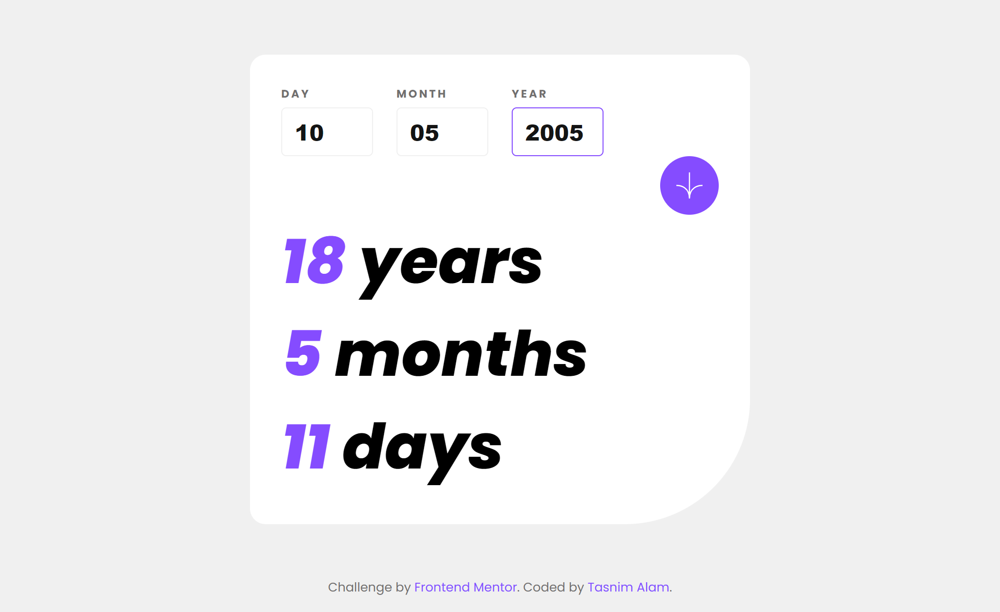
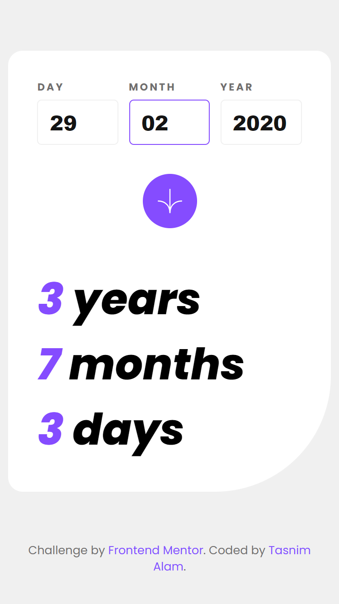

# Frontend Mentor - Age calculator app solution


This is a solution to the [Age calculator app challenge on Frontend Mentor](https://www.frontendmentor.io/challenges/age-calculator-app-dF9DFFpj-Q). Frontend Mentor challenges help you improve your coding skills by building realistic projects.

## Table of contents

- [Overview](#overview)
  - [The challenge](#the-challenge)
  - [Screenshot](#screenshot)
  - [Links](#links)
- [My process](#my-process)
  - [Built with](#built-with)
  - [What I learned](#what-i-learned)
  - [Useful resources](#useful-resources)
- [Author](#author)

## Overview

### The challenge

Users should be able to:

- View an age in years, months, and days after submitting a valid date through the form
- Receive validation errors if:
  - Any field is empty when the form is submitted
  - The day number is not between 1-31
  - The month number is not between 1-12
  - The year is in the future
  - The date is invalid e.g. 31/04/1991 (there are 30 days in April)
- View the optimal layout for the interface depending on their device's screen size
- See hover and focus states for all interactive elements on the page
- **Bonus**: See the age numbers animate to their final number when the form is submitted

### Screenshot




### Links

- Solution URL: [Repository](https://your-solution-url.com)
- Live Site URL: [Live preview](https://your-live-site-url.com)

## My process

### Built with

- Semantic HTML5 markup
- Flexbox
- CSS Grid
- Mobile-first workflow
- Anime.js

### What I learned

I learned how to work with moment.js library to validate and calculate age.

```js
const arrow = document.querySelector(".arrow");
const labels = document.querySelectorAll("label");
const inputs = document.querySelectorAll("input");
const errorMessages = document.querySelectorAll(".errorMessage");

arrow.addEventListener("click", calculate);

function calculate() {
  const inputDay = document.querySelector("#inputDay").value;
  const inputMonth = document.querySelector("#inputMonth").value;
  const inputYear = document.querySelector("#inputYear").value;

  const outputYear = document.querySelector("#outputYear");
  const outputMonth = document.querySelector("#outputMonth");
  const outputDay = document.querySelector("#outputDay");

  // Validation
  const inputDate = `${inputYear}-${inputMonth}-${inputDay}`;
  const isValidDate = moment(inputDate).isValid();

  if (
    inputDay.length === 2 &&
    inputMonth.length === 2 &&
    inputYear.length === 4 &&
    inputYear < new Date().getFullYear() &&
    isValidDate === true
  ) {
    calculateAge();
  } else {
    console.log('error')
  }

  // Calculate age
  function calculateAge() {
    outputYear.textContent = moment().diff(inputDate, "years");
    outputMonth.textContent = moment().diff(inputDate, "months") % 12;
    outputDay.textContent = moment().diff(inputDate, "days") % 30;
  }
}
```

### Useful resources

- [moment.js](https://momentjs.com/) - This helped me for date validation and age calculation

## Author
- Website - [Tasnim Alam](https://github.com/Tasnim005)
- Frontend Mentor - [Tasnim005](https://www.frontendmentor.io/profile/Tasnim005)

